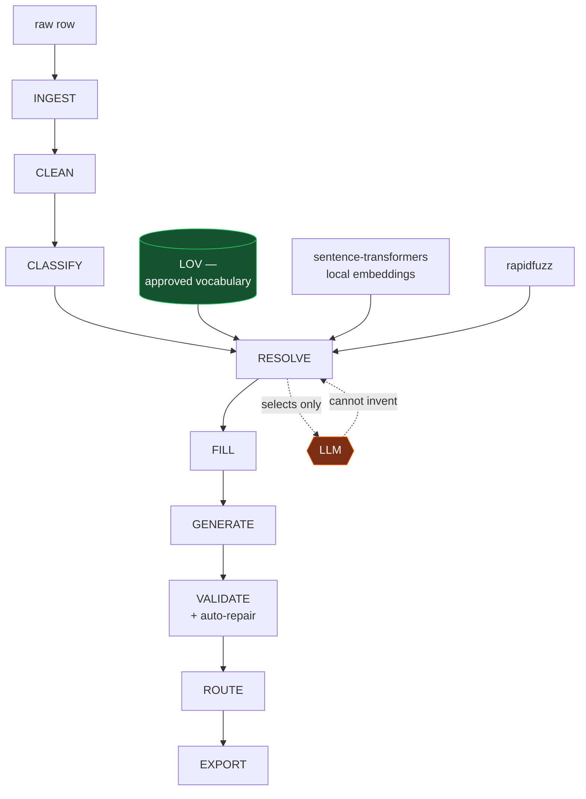
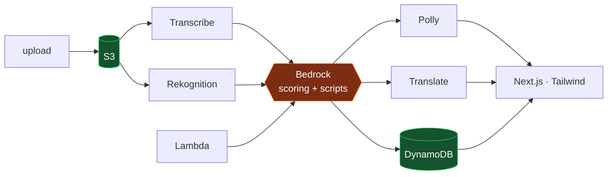
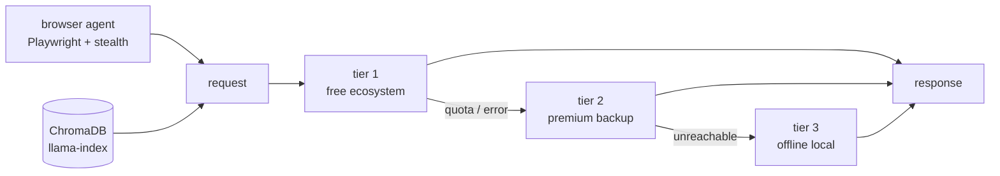

<div align="center">


[](https://github.com/PravAl2028)

[](https://github.com/PravAl2028)
[](https://leetcode.com/u/Praval_Anachi)
[](https://github.com/PravAl2028/PravAl2028/issues/new?title=Hello%20Praval&body=Hi%20Praval%2C%0A%0A)

<br>


<!--
  komarev hardcodes #555 for the label half and ignores labelColor/logo entirely, so this
  badge can't be made to match the ones above it. The eye glyph is the only icon it accepts,
  and #1f6feb is chosen because komarev forces white counter text — white on the 2EE6D6
  accent fails contrast. Delete this line if you'd rather have a perfectly uniform row.
-->


</div>

---

## `> whoami`

```bash
$ cat .profile

ROLE      =  AI / Systems Engineer  ·  CS undergrad
FOCUS     =  agentic AI | on-device perception | privacy-preserving pipelines
STACK     =  Python · TypeScript · Rust · FastAPI · React · Playwright · ONNX · AWS
SHORTLIST =  Smart India Hackathon 2025  ·  AI for Bharat 2026 (AWS-sponsored)
THESIS    =  constrain the model, then let it run
OPEN_TO   =  SWE / AI Engineering internships and roles
```

I build systems where the interesting part is the **constraint**, not the model call.
A redaction gate that makes PII leakage structurally impossible. An enrichment engine where
the LLM can only *select* from an approved vocabulary and never *author* a value. An agent
whose failure modes are recovery tiers rather than crashes.

The numbers on this page are measured from the repositories, not estimated — 142,440 lines
of hand-written source and 902 test cases, counted across all fourteen.

---

## `> pick-a-path`

> Four ways in. Open the one that matches why you're here.

<details>
<summary><b>&nbsp;&#9656;&nbsp; I'm hiring / evaluating &nbsp;&nbsp;<code>~2 min</code></b></summary>
<br>

| What I actually did | Where | Verified evidence |
|---|---|---|
| Built a one-way redaction gate so a browser agent's screenshots **cannot** leak PII | [SIH26171](https://github.com/PravAl2028/SIH26171) | 78,579 LOC · **807 test cases** across 47 files · 4 ONNX models running in-browser |
| Made hallucinated attribute values *impossible*, not unlikely | [Anvil](https://github.com/PravAl2028/Anvil) | 10,110 LOC · **95 test cases** · resolver returns only approved-vocabulary rows |
| Shipped a national-hackathon AI product on **9 AWS services** | [ContentIQ2](https://github.com/PravAl2028/ContentIQ2) | Bedrock · Lambda · S3 · Polly · Rekognition · Transcribe · Translate · DynamoDB |
| Shipped a multilingual civic platform with multi-agent verification | [Nagarika](https://github.com/PravAl2028/Nagarika) | 13,140 LOC · [live app](https://civic-succedent.web.app) · [demo video](https://youtu.be/KM1cv3nBvdQ) |
| Wrote a desktop video editor's systems core in Rust | [OverEdit](https://github.com/PravAl2028/OverEdit) | 665 LOC Rust · FFmpeg service · Tauri v2 IPC commands |

**Strengths** — system design under hard constraints · writing the design document *before*
the code · testing at a density most student projects never reach.

**Sharpening** — distributed systems · evaluation methodology · Rust beyond the FFI boundary.

**Credentials** — NPTEL *Problem Solving Through Programming in C* (**Top 1%**) ·
NPTEL *The Joy of Computing Using Python* (**93%, Gold + Elite**) ·
Databricks *Generative AI Fundamentals*.

</details>

<details>
<summary><b>&nbsp;&#9656;&nbsp; I'm an engineer — show me the mechanism &nbsp;&nbsp;<code>~5 min</code></b></summary>
<br>

**The redaction gate.** Perception runs entirely in the extension. Exactly one artefact
crosses the network per agent step, and it has already been stripped.

<div align="center">
  
</div>

Detection is layered — `l0-structural.ts` catches shape (card numbers, emails, coordinates),
`l1-lexical.ts` catches language, and the ONNX tier runs `ocr-det` / `ocr-rec` for text in
pixels and `face-yunet` for faces. `gate.ts` is the one-way boundary; `policy.ts` decides
what a finding means. The manifest makes each redaction auditable instead of trust-me.

```
extension/src/redaction/
├── l0-structural.ts     shape-based detection
├── l1-lexical.ts        language-based detection
├── gate.ts              the one-way boundary  ←  the whole idea
├── policy.ts            finding → action
├── marks.ts  merge.ts   overlay geometry
└── validators.ts        + 5 co-located test files
```

---

**Anvil — the LLM never authors a value.** Every stage after RESOLVE is lookup, rule and template.



Twelve pipeline packages under `src/anvil/` — `ingest`, `normalize`, `classify`, `resolve`,
`generate`, `validate`, `evaluate`, `report`, `dedupe`, `extract`, `sources`. Retrieval is
local: `sentence-transformers` for embeddings, `rapidfuzz` for lexical matching, so the
resolver costs nothing per row. Three guarantees are structural, each pinned by a named test.

---

**ContentIQ2 — an AWS-native media pipeline.**



Nine AWS SDK clients in `package.json`, `fluent-ffmpeg` for frame and audio segmentation,
`next-auth` for sessions. 53 commits — the most iterated repo here.

---

**Forest AI — tiered fallback as a first-class design.**



40 Python modules across the FastAPI backend. `playwright-stealth` and `duckduckgo-search`
drive the autonomous agent; `pymupdf` + `pypdf` + `python-docx` feed the RAG tier.

</details>

<details>
<summary><b>&nbsp;&#9656;&nbsp; I'm a hackathon judge &nbsp;&nbsp;<code>~1 min</code></b></summary>
<br>

| Event | Project | Brief | Where to look first |
|---|---|---|---|
| **Smart India Hackathon** — ISRO / Dept. of Space | [SIH26171](https://github.com/PravAl2028/SIH26171) | On-device visual perception for light-weight browser agents | `CLAUDE.md` — nine invariants and the mistakes the project expects |
| **AI for Bharat 2026** — AWS-sponsored | [ContentIQ2](https://github.com/PravAl2028/ContentIQ2) | Predict and improve video engagement before publishing | `package.json` — the nine AWS clients |
| **UniHack 2026** | [Anvil](https://github.com/PravAl2028/Anvil) | Limited product info → commerce-ready intelligence | `make eval` — the Day-0 leaderboard gate |
| **Hack the Limit** | [Nagarika](https://github.com/PravAl2028/Nagarika) | Civic issue reporting and resolution | evaluator credentials table in the README |
| **HacktoberFest 2025** — COSC Club | — | Open-source participation | — |

</details>

<details>
<summary><b>&nbsp;&#9656;&nbsp; Show me the receipts — every repo, measured &nbsp;&nbsp;<code>data</code></b></summary>
<br>

Counted from clones: source lines exclude `node_modules`, `dist`, `build` and `target`.

| Repo | Source LOC | Files | Commits | Test cases | Primary stack |
|---|---:|---:|---:|---:|---|
| [SIH26171](https://github.com/PravAl2028/SIH26171) | **78,579** | 386 | 38 | **807** | TypeScript · Python · ONNX |
| [Culinary Nest](https://github.com/PravAl2028/Culinary_Nest-Kitchen-Manager-) | 15,396 | 83 | 5 | — | React 19 · Capacitor · Gemini |
| [Nagarika](https://github.com/PravAl2028/Nagarika) | 13,140 | 65 | 23 | — | React · Leaflet · Turf · Firebase |
| [Anvil](https://github.com/PravAl2028/Anvil) | 10,110 | 102 | 8 | **95** | Python · FastAPI · pandas |
| [ContentIQ2](https://github.com/PravAl2028/ContentIQ2) | 8,911 | 80 | 53 | 3 | Next.js · 9× AWS SDK |
| [ContentIQ](https://github.com/PravAl2028/ContentIQ) | 5,583 | 23 | 1 | — | React · Vite |
| [Forest AI](https://github.com/PravAl2028/Forest-AI---Agentic-AI) | 5,184 | 68 | 2 | — | FastAPI · ChromaDB · Playwright |
| [OverEdit](https://github.com/PravAl2028/OverEdit) | 2,890 | 90 | 1 | — | Rust · Tauri v2 · React |
| [E-Learning Platform](https://github.com/PravAl2028/E-Learning-Platform) | 1,983 | 14 | 4 | — | HTML5 · CSS Grid · JS |
| [Employee Management System](https://github.com/PravAl2028/Employee_Management_System) | 664 | 19 | 5 | — | Vue 3 · Bootstrap 5 |
| **total** | **142,440** | **930** | **140** | **902** | |

Forks and team repos not counted above: [Code2Crop](https://github.com/PravAl2028/Code2Crop) ·
[Content_IQ](https://github.com/PravAl2028/Content_IQ) ·
[hadoop-data-sanitizer](https://github.com/PravAl2028/hadoop-data-sanitizer) ·
[HTF25-Team-312](https://github.com/PravAl2028/HTF25-Team-312).

</details>

---

## `> tech-stack`

<div align="center">


<br/>

<br/>


</div>

| Domain | What I actually reach for | Proven in |
|---|---|---|
| **Agentic AI** | Playwright + stealth, semantic DOM understanding over CSS/XPath, tool-calling, recovery tiers | Forest AI · SIH26171 |
| **On-device ML** | ONNX Runtime Web, OCR detection + recognition, face detection, NER tokenisers | SIH26171 |
| **Generative AI** | Gemini, AWS Bedrock, OpenRouter, constrained decoding, provenance-carrying output | Anvil · ContentIQ2 · Nagarika |
| **RAG** | ChromaDB, llama-index, sentence-transformers, neighbour-chunk expansion | Forest AI |
| **Computer Vision / OCR** | OpenCV + Tesseract extraction, structured parsing of unstructured documents | Resume Analyzer · SIH26171 |
| **Backend & Data** | FastAPI, Express, PostgreSQL, MongoDB, MySQL, ETL basics, data warehousing | Anvil · Nagarika · Culinary Nest |
| **Cloud** | AWS S3, Lambda, Bedrock, EC2 · Vercel · Firebase · Railway | ContentIQ2 · Nagarika |
| **Systems** | Rust, Tauri v2 IPC, FFmpeg binding, Web Audio API | OverEdit |
| **Core CS** | Data structures & algorithms — [LeetCode](https://leetcode.com/u/Praval_Anachi) | — |

---

## `> cat ./languages`

<div align="center">
  
</div>

---

## `> ls ./projects`

<details open>
<summary><b>&#9654;&nbsp; SIH26171 — Redaction Gate &nbsp;·&nbsp; <code>78,579 LOC</code> <code>807 tests</code></b></summary>
<br>

A privacy-preserving browser agent. All visual perception happens on the user's machine; one
redacted artefact per step crosses the network, with a manifest saying what was removed and why.

| Aspect | Detail |
|---|---|
| **Stack** | TypeScript · Python · FastAPI · ONNX Runtime Web · Zod · Vitest · Docker |
| **Models** | `ocr-det` · `ocr-rec` · `face-yunet` · NER tokeniser — all running in-browser |
| **Scale** | 386 files · 78,579 source lines · 807 test cases across 47 test files |
| **Design** | `CLAUDE.md` documents nine invariants before a line of implementation |
| **Context** | Smart India Hackathon — ISRO / Department of Space problem statement |
| **Repo** | [PravAl2028/SIH26171](https://github.com/PravAl2028/SIH26171) |

</details>

<details>
<summary><b>&#9654;&nbsp; ContentIQ2 — AI Video Content Analyzer &nbsp;·&nbsp; <code>9 AWS services</code> <code>53 commits</code></b></summary>
<br>

Helps creators predict and improve a video's engagement *before* publishing. Breaks video into
frames and audio segments, scores each through Bedrock models, and returns director-level
suggestions. An AI-driven script generator turns topic inputs into structured scripts with
scene flow, narration and engagement hooks.

| Aspect | Detail |
|---|---|
| **Stack** | Next.js · TypeScript · Tailwind · NextAuth · fluent-ffmpeg · Framer Motion |
| **AWS** | Bedrock · Bedrock Runtime · Lambda · S3 · Polly · Rekognition · Transcribe · Translate · DynamoDB |
| **Scale** | 8,911 LOC · 80 files · 53 commits — the most iterated project here |
| **Context** | AI for Bharat — national-level hackathon sponsored by AWS · deployed on EC2 |
| **Repo** | [PravAl2028/ContentIQ2](https://github.com/PravAl2028/ContentIQ2) |

</details>

<details>
<summary><b>&#9654;&nbsp; Anvil — Product Intelligence That Can't Hallucinate &nbsp;·&nbsp; <code>95 tests</code></b></summary>
<br>

Industrial catalogue enrichment where the LLM only *selects* from retrieved, approved
candidates and never authors one. Everything downstream is lookup, rule and template.

| Aspect | Detail |
|---|---|
| **Stack** | Python · FastAPI · pandas · pydantic · Typer · sentence-transformers · rapidfuzz · Gemini |
| **Guarantees** | value can't leave the vocabulary · description can't breach its character window · provenance is the resolver's return type |
| **Scale** | 10,110 LOC · 12 pipeline packages · 95 test cases |
| **Proof** | reproduces the solution guide's invoice description byte-for-byte, 38 chars, from structured slots |
| **Context** | UniHack 2026 |
| **Repo** | [PravAl2028/Anvil](https://github.com/PravAl2028/Anvil) |

</details>

<details>
<summary><b>&#9654;&nbsp; Forest AI — Persistent Autonomous Research Agent</b></summary>
<br>

An AI-powered research and browser automation agent that navigates websites, extracts
information and answers user queries. Uses semantic browser understanding with Playwright and
accessibility trees to interact with dynamic sites — no fragile CSS/XPath selectors.

| Aspect | Detail |
|---|---|
| **Stack** | FastAPI · SQLAlchemy · PostgreSQL · ChromaDB · llama-index · Playwright + stealth · React |
| **Agent** | `duckduckgo-search` for discovery, accessibility-tree navigation, screenshot capture |
| **RAG** | OCR-backed text extraction, article parsing, neighbour-chunk expansion, citation-aware answers |
| **Resilience** | three-tier provider fallback — free ecosystem → premium backup → offline local |
| **Scale** | 5,184 LOC · 40 Python modules |
| **Repo** | [PravAl2028/Forest-AI---Agentic-AI](https://github.com/PravAl2028/Forest-AI---Agentic-AI) |

</details>

<details>
<summary><b>&#9654;&nbsp; Nagarika — Civic Issue Platform &nbsp;·&nbsp; <code>live</code></b></summary>
<br>

Scan a hazard, a multi-agent Gemini pipeline verifies and classifies it, then the app drafts
the formal complaint and the escalation path. Multilingual, with hazard-aware routing so
pedestrians and riders can avoid active hazards.

| Aspect | Detail |
|---|---|
| **Stack** | React · TypeScript · Gemini · Firebase · Express · Railway · Leaflet + **Turf.js** geospatial |
| **Scale** | 13,140 LOC · 65 files · 23 commits |
| **Live** | [civic-succedent.web.app](https://civic-succedent.web.app) · [demo video](https://youtu.be/KM1cv3nBvdQ) |
| **Context** | Hack the Limit — evaluator credentials are in the repo README |
| **Repo** | [PravAl2028/Nagarika](https://github.com/PravAl2028/Nagarika) |

</details>

<details>
<summary><b>&#9654;&nbsp; OverEdit — Desktop Video Editor &nbsp;·&nbsp; <code>Rust core</code></b></summary>
<br>

A non-linear editor with a magnetic timeline: real ripple-edit collision logic, global snapping
guides, Web Audio multi-track mixing with ducking, and Rust-threaded waveform extraction.

| Aspect | Detail |
|---|---|
| **Stack** | Rust · Tauri v2 · React · Zustand · FFmpeg · Vite |
| **Rust core** | 665 LOC — `ffmpeg_service.rs`, plus `media` / `timeline` / `export` IPC command modules |
| **Frontend** | immutable undo/redo history, ghost-drag group visualisation, frame-strip thumbnailing |
| **Repo** | [PravAl2028/OverEdit](https://github.com/PravAl2028/OverEdit) |

</details>

<details>
<summary><b>&#9654;&nbsp; Culinary Nest — Kitchen Manager &nbsp;·&nbsp; <code>15,396 LOC</code></b></summary>
<br>

Collaborative kitchen management with room-based cooking collaboration and family voting for
dish approval. AI-generated weekly meal plans, recipe suggestions, Smart Picks and shopping
list management.

| Aspect | Detail |
|---|---|
| **Stack** | React 19 · TypeScript · Express · MongoDB Atlas · Gemini · **Capacitor** (Android build) |
| **Scale** | 15,396 LOC · 83 files — the second-largest codebase here |
| **Deploy** | Vercel, accessible across devices |
| **Repo** | [PravAl2028/Culinary_Nest-Kitchen-Manager-](https://github.com/PravAl2028/Culinary_Nest-Kitchen-Manager-) |

</details>

<details>
<summary><b>&#9654;&nbsp; Resume Analyzer — OCR document understanding &nbsp;·&nbsp; <code>not yet public</code></b></summary>
<br>

Reads PDF resumes with OpenCV and Tesseract OCR, extracts the text, organises it into sections
(skills, education, experience), then uses the Gemini API to suggest content and formatting
improvements.

| Aspect | Detail |
|---|---|
| **Stack** | Python · OpenCV · Tesseract OCR · Gemini API |
| **Pipeline** | PDF → image preprocessing → OCR → section segmentation → LLM critique |
| **Status** | the repository is not public yet |

</details>

<details>
<summary><b>&#9654;&nbsp; Earlier work — the foundations</b></summary>
<br>

| Project | Stack | Note |
|---|---|---|
| [ContentIQ](https://github.com/PravAl2028/ContentIQ) | React · Vite · JS | The first pass at the creator toolkit — [live](https://content-iq-pearl.vercel.app) |
| [Employee Management System](https://github.com/PravAl2028/Employee_Management_System) | Vue 3 · Bootstrap 5 · Axios | Clean CRUD reference app — [live](https://employee-management-system-alpha-seven.vercel.app) |
| [E-Learning Platform](https://github.com/PravAl2028/E-Learning-Platform) | HTML5 · CSS Grid · JS | *Upskill* — no frameworks, XML/XSD-validated course data |
| [Code2Crop](https://github.com/PravAl2028/Code2Crop) | AI · agritech | Crop recommendations, disease diagnosis, multilingual voice — [live](https://code2-crop.vercel.app) |
| [hadoop-data-sanitizer](https://github.com/PravAl2028/hadoop-data-sanitizer) | Hadoop | Big-data sanitisation, as a collaborator |

</details>

---

## `> credentials`

<div align="center">

| Certificate | Issuer | Result |
|---|---|---|
| Problem Solving Through Programming in C | NPTEL | **Top 1%** |
| The Joy of Computing Using Python | NPTEL | **93% · Gold + Elite** |
| Generative AI Fundamentals | Databricks | Completed |

</div>

**Activities** — Shortlisted, Smart India Hackathon (2025) · HacktoberFest with COSC Club (2025) ·
Shortlisted, AI for Bharat national hackathon sponsored by AWS (2026)

---

## `> git log --stat`

<div align="center">

<!--
  Generated by .github/workflows/metrics.yml and committed into this repo, so they don't
  depend on a third-party host staying up.
-->
<picture>
  <source media="(prefers-color-scheme: dark)" srcset="metrics/overview-dark.svg">
  
</picture>

<picture>
  <source media="(prefers-color-scheme: dark)" srcset="metrics/habits-dark.svg">
  
</picture>

<br>

<picture>
  <source media="(prefers-color-scheme: dark)" srcset="https://streak-stats.demolab.com/?user=PravAl2028&hide_border=true&theme=github-dark-blue&background=0d1117&ring=2EE6D6&fire=ea580c&currStreakLabel=2EE6D6">
  
</picture>


</div>

---

## `> tail -f ./activity`

<!-- ACTIVITY:START -->
| when | what |
|---|---|
| `3d ago` | pushed 1 commit to [`PravAl2028`](https://github.com/PravAl2028/PravAl2028) |
| `3d ago` | branched `main` in [`PravAl2028`](https://github.com/PravAl2028/PravAl2028) |
| `5d ago` | joined [`techsurge-2k26-pravniksai`](https://github.com/HackIndiaXYZ/techsurge-2k26-pravniksai) as a collaborator |
| `1w ago` | branched `Dilip` in [`SIH26171`](https://github.com/PravAl2028/SIH26171) |
| `2w ago` | pushed 1 commit to [`SIH26171`](https://github.com/PravAl2028/SIH26171) |
| `3w ago` | starred [`browser-use`](https://github.com/browser-use/browser-use) |

<sub>Rebuilt automatically at 2026-09-16 21:04 UTC. Six most recent distinct public events.</sub>
<!-- ACTIVITY:END -->

<div align="center">

<picture>
  <source media="(prefers-color-scheme: dark)" srcset="https://raw.githubusercontent.com/PravAl2028/PravAl2028/output/snake-dark.svg">
  
</picture>

</div>

---

<div align="center">

```console
anachi@github:~$ echo $PHILOSOPHY
> Make the bad outcome impossible, not improbable.

anachi@github:~$ exit
```


</div>
