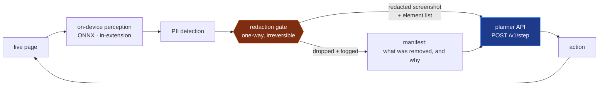
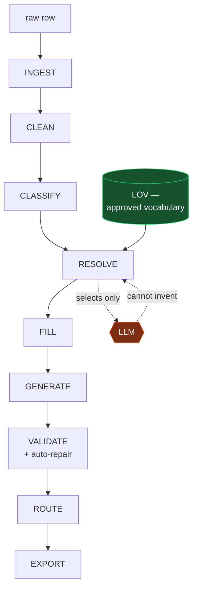
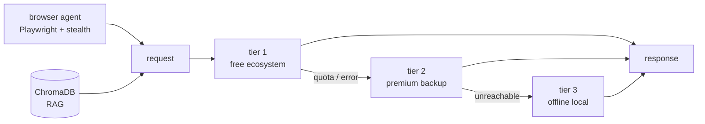
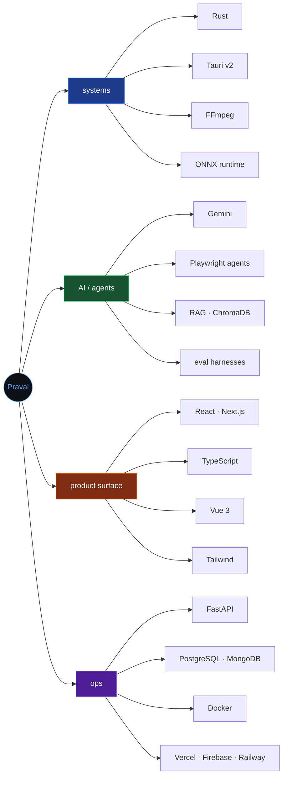

<div align="center">

```
 ┌─────────────────────────────────────────────────────────────────┐
 │                                                                 │
 │     A N A C H I   P R A V A L                                   │
 │     ─────────────────────────────────────────────                │
 │     agentic AI systems · privacy-preserving pipelines           │
 │                                                                 │
 │     anachi@github:~$ _                                          │
 │                                                                 │
 └─────────────────────────────────────────────────────────────────┘
```

<a href="https://github.com/PravAl2028?tab=repositories"></a>
<a href="#-ls-flagships"></a>


</div>

---

## `$ whoami`

```console
anachi@github:~$ whoami --verbose

  name    : Anachi Praval
  focus   : agentic AI systems · privacy-preserving pipelines · developer tooling
  stack   : TypeScript · Python · Rust · FastAPI · React · Playwright · ONNX
  mode    : hackathon-cadence builder — ISRO/DoS, UniHack 2026, Hack the Limit
  thesis  : constrain the model, then let it run. Guarantees beat good intentions.

anachi@github:~$ _
```

I build systems where the interesting part is the **constraint**, not the model call.
A redaction gate that makes PII leakage structurally impossible. An enrichment engine
where the LLM can only *select* from an approved vocabulary and never *author* a value.
An agent whose failure modes are recovery tiers rather than crashes.

---

## `$ cd ./pick-a-path`

> Three ways into this profile. Open the one that matches why you are here.

<details>
<summary><b>&nbsp;&#9656;&nbsp; I am hiring / evaluating &nbsp;&nbsp;<code>~2 min</code></b></summary>
<br>

**The short version.** Six substantial systems shipped in eighteen months, several under hackathon deadlines against real institutional briefs.

| What I actually did | Where | Evidence |
|---|---|---|
| Designed a one-way redaction gate so an agent's screenshots cannot leak PII | [SIH26171](https://github.com/PravAl2028/SIH26171) | nine documented invariants, ONNX on-device inference, eval harness |
| Made hallucinated attribute values *impossible*, not unlikely | [Anvil](https://github.com/PravAl2028/Anvil) | 38 tests; the resolver returns only approved-vocabulary rows |
| Shipped a multilingual civic platform with multi-agent verification | [Nagarika](https://github.com/PravAl2028/Nagarika) | [live app](https://civic-succedent.web.app) · [demo video](https://youtu.be/KM1cv3nBvdQ) |
| Built a desktop video editor with a magnetic timeline in Rust + Tauri | [OverEdit](https://github.com/PravAl2028/OverEdit) | ripple editing, Web Audio ducking, FFmpeg binding |

**Strengths** — system design under hard constraints · writing the design document *before* the code · shipping to a deadline with the tests still passing.

**Currently sharpening** — distributed systems, evaluation methodology, Rust beyond the FFI boundary.

Reach me &rarr; [open an issue on this repo](https://github.com/PravAl2028/Praval-Anachi/issues/new?title=Hello%20Praval&body=Hi%20Praval%2C%0A%0A)

</details>

<details>
<summary><b>&nbsp;&#9656;&nbsp; I am an engineer — show me the architecture &nbsp;&nbsp;<code>~5 min</code></b></summary>
<br>

**SIH26171 — the redaction gate.** Exactly one artefact crosses the network per agent step, and it has already been stripped.



The gate is the whole idea: perception is local, the network sees only post-gate bytes, and the manifest makes every redaction auditable instead of trust-me.

---

**Anvil — the LLM never authors a value.** Every stage after RESOLVE is lookup, rule and template.



Three guarantees are structural, each pinned by a named test: a value cannot leave the vocabulary, a description cannot breach its character window, and provenance is the resolver's *return type* rather than a log line.

---

**Forest AI — tiered fallback as a first-class design.**



</details>

<details>
<summary><b>&nbsp;&#9656;&nbsp; I am a hackathon judge &nbsp;&nbsp;<code>~1 min</code></b></summary>
<br>

| Event | Project | Brief | Status |
|---|---|---|---|
| **ISRO / Dept. of Space** | [SIH26171](https://github.com/PravAl2028/SIH26171) | On-device visual perception for light-weight browser agents | design doc + eval harness in repo |
| **UniHack 2026** | [Anvil](https://github.com/PravAl2028/Anvil) | Turn limited product information into commerce-ready intelligence | 38 tests · sealed holdout split |
| **Hack the Limit** | [Nagarika](https://github.com/PravAl2028/Nagarika) | Civic issue reporting and resolution | [live](https://civic-succedent.web.app) · [video](https://youtu.be/KM1cv3nBvdQ) · evaluator credentials in README |
| **HackTheFuture 25** | [HTF25-Team-312](https://github.com/PravAl2028/HTF25-Team-312) | Team submission | archived |

**Where to look first in each repo** — `CLAUDE.md` in SIH26171 (nine invariants and the mistakes the project expects), `make eval` in Anvil (the Day-0 leaderboard gate), the credentials table in Nagarika's README.

</details>

---

## `$ ls ./flagships`

<table>
<tr>
<td width="50%" valign="top">

### [SIH26171](https://github.com/PravAl2028/SIH26171) — Redaction Gate

`TypeScript` `Python` `ONNX` `FastAPI` `Docker`

A privacy-preserving browser agent. All visual perception happens on the user's machine; one redacted artefact per step crosses the network, with a manifest saying what was removed and why.

**38 commits · 9 invariants · eval harness**
<br>ISRO / Department of Space brief.

</td>
<td width="50%" valign="top">

### [Anvil](https://github.com/PravAl2028/Anvil) — Product Intelligence

`Python` `PostgreSQL` `pytest` `Gemini`

Industrial catalogue enrichment that cannot make things up. The model selects from retrieved, approved candidates; everything downstream is lookup, rule and template.

**38 tests · byte-exact invoice reproduction**
<br>UniHack 2026.

</td>
</tr>
<tr>
<td width="50%" valign="top">

### [Nagarika](https://github.com/PravAl2028/Nagarika) — Civic Platform

`TypeScript` `Gemini` `Firebase` `Railway`

Scan a hazard, a multi-agent pipeline verifies and classifies it, then the app drafts the formal complaint and the escalation path. Multilingual, with hazard-aware routing.

**[Live app](https://civic-succedent.web.app) · [Demo video](https://youtu.be/KM1cv3nBvdQ)**
<br>Hack the Limit.

</td>
<td width="50%" valign="top">

### [OverEdit](https://github.com/PravAl2028/OverEdit) — Desktop Editor

`Rust` `Tauri v2` `React` `Zustand` `FFmpeg`

A magnetic timeline with real ripple-edit collision logic, global snapping guides, Web Audio multi-track mixing with ducking, and Rust-threaded waveform extraction.

**Rust core · immutable undo/redo history**

</td>
</tr>
<tr>
<td width="50%" valign="top">

### [Forest AI](https://github.com/PravAl2028/Forest-AI---Agentic-AI) — Agentic Workspace

`Python` `FastAPI` `Playwright` `ChromaDB`

Multi-provider agentic platform: an autonomous browser agent, long-term memory, RAG over PDF/DOCX/TXT, and a three-tier fallback chain that degrades instead of failing.

**Stealth Playwright · strict collection isolation**

</td>
<td width="50%" valign="top">

### [Culinary Nest](https://github.com/PravAl2028/Culinary_Nest-Kitchen-Manager-) — Kitchen Manager

`TypeScript` `React 19` `Express` `MongoDB` `Gemini`

Room-based cooking collaboration with AI weekly meal plans, recipe suggestions and automated shopping lists.

**Full-stack · MongoDB Atlas**

</td>
</tr>
</table>

<details>
<summary><b>&nbsp;&#9656;&nbsp; the rest of the shelf &nbsp;<code>ls -a</code></b></summary>
<br>

| Repo | Stack | Note |
|---|---|---|
| [ContentIQ2](https://github.com/PravAl2028/ContentIQ2) | Next.js · TypeScript | Creator toolkit — transcript analysis into adaptive music strategy and scene insights. **53 commits**, the most iterated repo here. |
| [ContentIQ](https://github.com/PravAl2028/ContentIQ) | JavaScript | The earlier line of the same idea — [live](https://content-iq-pearl.vercel.app) |
| [Employee Management System](https://github.com/PravAl2028/Employee_Management_System) | Vue 3 · Bootstrap 5 | Clean CRUD reference app — [live](https://employee-management-system-alpha-seven.vercel.app) |
| [E-Learning Platform](https://github.com/PravAl2028/E-Learning-Platform) | HTML5 · CSS3 · JS | *Upskill* — vanilla CSS Grid, no frameworks, XML/XSD-validated data |
| [Code2Crop](https://github.com/PravAl2028/Code2Crop) | — | Agricultural intelligence platform — [live](https://code2-crop.vercel.app) |
| [hadoop-data-sanitizer](https://github.com/PravAl2028/hadoop-data-sanitizer) | — | Big-data sanitisation work |

</details>

---

## `$ cat ./languages`

```text
                                                     bytes across 14 repos
  TypeScript  ██████████████████████████░░░░░░░░░░░░░░░░░░░░░░░░░░  51.7%
  HTML        ████████████░░░░░░░░░░░░░░░░░░░░░░░░░░░░░░░░░░░░░░░░  23.3%
  Python      █████████░░░░░░░░░░░░░░░░░░░░░░░░░░░░░░░░░░░░░░░░░░░  17.2%
  JavaScript  ███░░░░░░░░░░░░░░░░░░░░░░░░░░░░░░░░░░░░░░░░░░░░░░░░░   5.4%
  CSS         █░░░░░░░░░░░░░░░░░░░░░░░░░░░░░░░░░░░░░░░░░░░░░░░░░░░   1.3%
  Rust        ░░░░░░░░░░░░░░░░░░░░░░░░░░░░░░░░░░░░░░░░░░░░░░░░░░░░   0.5%
  Vue         ░░░░░░░░░░░░░░░░░░░░░░░░░░░░░░░░░░░░░░░░░░░░░░░░░░░░   0.3%

  also        PLpgSQL · Makefile · Dockerfile · Batchfile · Java
  note        HTML is inflated by generated demo pages and templates in
              SIH26171 and Anvil — the hand-written surface is TS and Python.
```

<details>
<summary><b>&nbsp;&#9656;&nbsp; how I actually reach for tools &nbsp;<code>--graph</code></b></summary>
<br>



</details>

---

## `$ git log --stat`

<div align="center">

<!--
  These two panels are generated by .github/workflows/metrics.yml and committed into
  this repo, so they do not depend on a third-party host staying up. They render as
  broken images until that workflow has run once - trigger it from the Actions tab.
-->
<picture>
  <source media="(prefers-color-scheme: dark)" srcset="metrics/overview-dark.svg">
  
</picture>

<picture>
  <source media="(prefers-color-scheme: dark)" srcset="metrics/habits-dark.svg">
  
</picture>

<br>

<picture>
  <source media="(prefers-color-scheme: dark)" srcset="https://streak-stats.demolab.com/?user=PravAl2028&hide_border=true&theme=github-dark-blue&background=0d1117&ring=58a6ff&fire=ea580c&currStreakLabel=58a6ff">
  
</picture>

</div>

---

## `$ tail -f ./activity`

<!-- ACTIVITY:START -->
| when | what |
|---|---|
| `just now` | branched `main` in [`Praval-Anachi`](https://github.com/PravAl2028/Praval-Anachi) |
| `2d ago` | joined [`techsurge-2k26-pravniksai`](https://github.com/HackIndiaXYZ/techsurge-2k26-pravniksai) as a collaborator |
| `4d ago` | branched `Dilip` in [`SIH26171`](https://github.com/PravAl2028/SIH26171) |
| `1w ago` | pushed 1 commit to [`SIH26171`](https://github.com/PravAl2028/SIH26171) |
| `2w ago` | starred [`browser-use`](https://github.com/browser-use/browser-use) |
| `2w ago` | forked [`hadoop-data-sanitizer`](https://github.com/Dilip-Reddymalla/hadoop-data-sanitizer) |

<sub>Rebuilt automatically at 2026-09-13 11:57 UTC. Six most recent distinct public events.</sub>
<!-- ACTIVITY:END -->

<div align="center">

<picture>
  <source media="(prefers-color-scheme: dark)" srcset="https://raw.githubusercontent.com/PravAl2028/Praval-Anachi/output/snake-dark.svg">
  
</picture>

</div>

---

## `$ ./contact`

<div align="center">

<a href="https://github.com/PravAl2028"></a>
<a href="https://github.com/PravAl2028/Praval-Anachi/issues/new?title=Hello%20Praval&body=Hi%20Praval%2C%0A%0A"></a>

<br><br>

```console
anachi@github:~$ echo $PHILOSOPHY
> Make the bad outcome impossible, not improbable.

anachi@github:~$ exit
```

</div>
